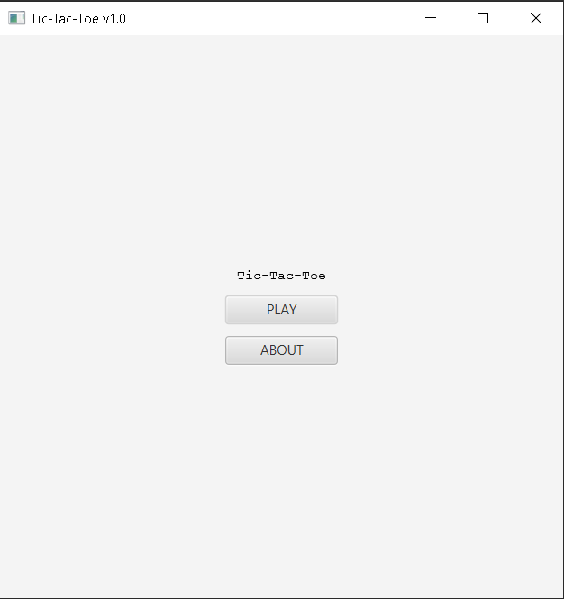
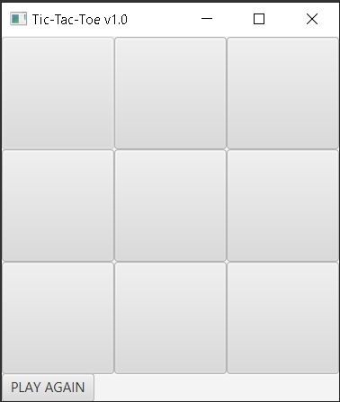

# Tic Tac Toe

### Project Information:
An application where two clients connect with each other through a TCP connection to a server
to play a game of tic tac toe.

### How-to-Run:
Ideally this application needs to be executed through an IDE such as intelliJ. Navigate to 
the Server class under src/server/Server and execute the server Class. Once that is done two cients
need to connect to the server by running the main class under src/client/clientInterface/Main. However,
before doing that in the main class you need to pass your computers ip address as command line arguments
when executing the Main class. Once that is done an interface will appear for the client.

Once two clients click on the play button the game will begin. When it is someones turn their
interface for the board will appear while for the other player their board will disappear to 
indicate that it is not their turn.

